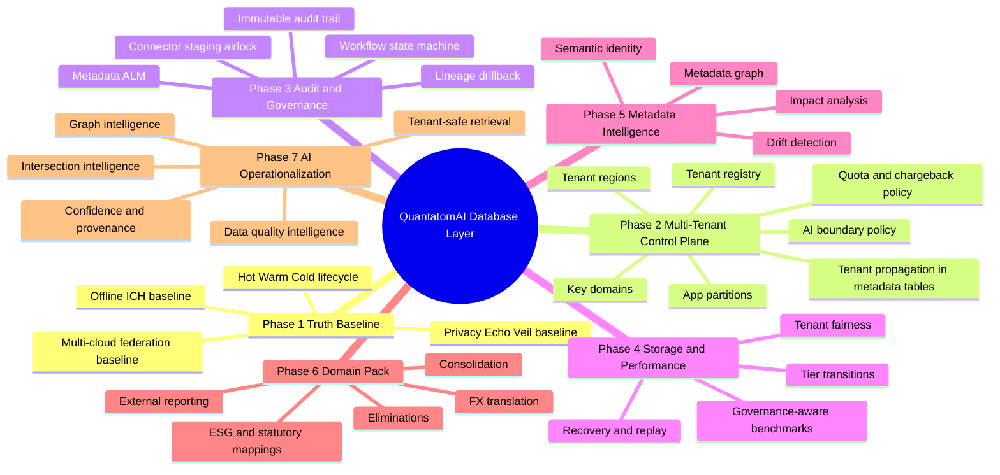

> SSOT Derivation Notice
> This document derives from the canonical architecture SSOT: [docs/architecture/quantatomai-single-source-of-truth.md](docs/architecture/quantatomai-single-source-of-truth.md).
> If any conflict exists, the SSOT prevails.

# QuantatomAI Database Layer Mind Map

This document is the evolving mind map for the overall database layer as hardening phases are implemented.

## Layered View

```mermaid
flowchart TD
    A[Board Brief] --> B[Engineering Playbook]
    B --> C[Phase 1 Truth Baseline]
    B --> D[Phase 2 Tenant Control Plane]
    B --> E[Phase 3 Audit and Workflow Governance]
    B --> F[Phase 4 Storage and Performance Hardening]
    B --> G[Phase 5 Metadata Intelligence]
    B --> H[Phase 6 Consolidation and Reporting Domain Pack]
    B --> I[Phase 7 AI Native Operationalization]

    D --> D1[Tenant Registry and Regions]
    D --> D2[Key Domains and Encryption Boundaries]
    D --> D3[Quota and Chargeback Policies]
    D --> D4[AI Boundary Policies]
    D --> D5[App Partition Registry]
    D --> D6[Tenant Context on Metadata Tables]

    C --> S1[Hot Warm Cold]
    C --> S2[Privacy PEV]
    C --> S3[Offline ICH]
    C --> S4[Multi-cloud Federation]

    E --> G1[Immutable Audit]
    E --> G2[Lineage]
    E --> G3[Approvals and Locks]

    I --> AI1[Feature Storage]
    I --> AI2[Explainability]
    I --> AI3[Tenant-safe Retrieval]
```

## Current Status Notes
- Phase 1: baseline docs now exist for storage lifecycle, privacy, federation, and offline conflict semantics.
- Phase 2: control-plane schema, validation checks, and implementation guide have been added.
- Phase 3: governance schema now includes immutable metadata audit events, workflow transition controls, promotion governance, and connector staging governance with validation checks.
- Phase 4: storage and performance hardening is now in progress with benchmark profiles, governance-on measurement requirements, an evidence bundle runner under `tools/load-testing`, and initial acceptance thresholds captured in dedicated implementation guides.
- Later phases should extend this mind map rather than creating disconnected architecture views.
